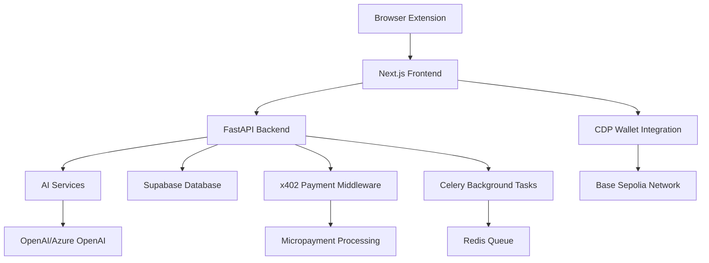

# 🌟 Wish - Universal Wishlist with Smart Insights

[](https://nextjs.org/)
[](https://fastapi.tiangolo.com/)
[](https://www.plasmo.com/)
[](https://docs.cdp.coinbase.com/)

> 🛍️ **Where do your future purchases hide before you're ready to buy?** Wish is a universal wishlist that converts intent through smart details, deal tracking, and impeccable organization.

## 📖 What is Wish?

**Wish** is the universal wishlist you've been waiting for. Instead of scattered screenshots, abandoned carts, and lost notes, Wish gives you a centralized place to track everything you want to buy - with smart insights and deal tracking built right in.

### 🎯 The Problem We Solve

Where do your future purchases hide before you're ready to buy?

- 📷 **Camera rolls** filled with product screenshots
- 📝 **Phone notes** with random product links
- 🛒 **Abandoned shopping carts** across multiple sites
- 🤷‍♀️ **Lost opportunities** when prices drop or items go on sale

### 💡 How Wish Works

**For Consumers:**

1. 🔗 **One-click adding** - Click the Wish button on any product page
2. 💰 **Embedded wallets** - Sign in with Coinbase using just your email and OTP
3. 🛒 **In-extension purchases** - Buy directly from the Chrome extension
4. 💳 **Easy top-up** - Integrated Onramp API for seamless wallet funding
5. 📊 **Smart organization** - Automatic categorization and deal tracking

**For Retailers:**

1. 📈 **Query insights** - Access wishlist data across all products using x402 micropayments
2. 💡 **Smart pricing** - Get average days on wishlist, price willingness data
3. 🎯 **Better targeting** - Understand demand signals before customers buy
4. 💰 **Convert intent** - Turn wishlist data into actual revenue

## 🏗️ Architecture



### 🔧 Tech Stack

#### **Frontend & Extension**

- **Next.js 15** with React 19 - Modern web application
- **Plasmo Framework** - Chrome extension development
- **TailwindCSS** - Responsive UI design
- **TypeScript** - Type-safe development

#### **Backend & AI**

- **FastAPI** - High-performance Python API
- **OpenAI/Azure OpenAI** - Advanced language models
- **LangChain** - AI workflow orchestration
- **Celery** - Distributed task processing
- **Redis** - Message queuing and caching

#### **Payments & Blockchain**

- **Coinbase CDP SDK** - Wallet and account management
- **x402 Protocol** - HTTP micropayment standard
- **Base Sepolia** - Ethereum L2 testnet
- **Smart Contract Integration** - Automated payment processing

#### **Data & Infrastructure**

- **Supabase** - PostgreSQL database with real-time features
- **Turborepo** - Monorepo build system
- **UV** - Fast Python package management
- **Playwright** - Web scraping and automation

## 🚀 Quick Start

### Prerequisites

- **Node.js 18+** and **Yarn**
- **Python 3.12+** and **UV**
- **Redis server**
- **Chrome browser** (for extension development)

### 1. Clone and Install

```bash
git clone https://github.com/your-username/wish-cdp-codenyc.git
cd wish-cdp-codenyc

# Install all dependencies
yarn install
```

### 2. Environment Setup

Create `.env` files in each app directory:

#### **FastAPI Backend** (`apps/fastapi/.env`)

```bash
# AI Services
AZURE_OPENAI_API_KEY=your_azure_openai_key
AZURE_OPENAI_ENDPOINT=https://your-endpoint.openai.azure.com/
MODEL=gpt-4

# Coinbase CDP
CDP_API_KEY_ID=your_cdp_api_key_id
CDP_API_KEY_SECRET=your_cdp_api_secret

# Database
SUPABASE_URL=your_supabase_url
SUPABASE_SERVICE_ROLE_KEY=your_supabase_service_key

# External APIs
GOOGLE_API_KEY=your_google_api_key
GOOGLE_CUSTOM_SEARCH_ENGINE_ID=your_search_engine_id
APIFY_API_TOKEN=your_apify_token

# Blockchain
WISH_WALLET=0x_your_wallet_address

# Infrastructure
REDIS_URL=redis://localhost:6379
PORT=8000
APP_ENV=development
```

#### **Next.js Frontend** (`apps/nextjs/.env.local`)

```bash
CDP_API_KEY_ID=your_cdp_api_key_id
CDP_API_KEY_SECRET=your_cdp_api_secret
CDP_WALLET_SECRET=your_wallet_secret
```

#### **Plasmo Extension** (`apps/plasmo/.env`)

```bash
PLASMO_PUBLIC_CLERK_PUBLISHABLE_KEY=your_clerk_key
PLASMO_PUBLIC_DEV_PORT=3000
```

### 3. Start Development

```bash
# Terminal 1: Start Redis
redis-server

# Terminal 2: Start all applications
yarn dev
```

This will launch:

- **FastAPI Backend**: http://localhost:8000
- **Next.js Frontend**: http://localhost:3000
- **Plasmo Extension**: Hot-reload in Chrome

### 4. Load Chrome Extension

1. Open Chrome and navigate to `chrome://extensions/`
2. Enable "Developer mode"
3. Click "Load unpacked" and select `apps/plasmo/build/chrome-mv3-dev/`

## 💰 Payment Flow

Our micropayment system uses the x402 protocol with Coinbase CDP:

```typescript
// 1. Client initiates payment request
const response = await fetchWithPayment("/api/query", {
  method: "POST",
  body: JSON.stringify({ query: "laptops under $1000" }),
});

// 2. x402 middleware intercepts and requests payment
// 3. CDP wallet automatically processes $0.001 payment
// 4. API returns wishlist insights data
// 5. Transaction hash provided for verification
```

### Supported Networks

- **Base Sepolia** (Development)
- **Base Mainnet** (Production ready)

## 🎯 Key Features

### 🔌 Chrome Extension Experience

- **🎯 One-Click Adding**: Simply click the Wish button on any product page
- **🔐 Embedded Wallets**: Sign in with just your email + Coinbase OTP
- **💳 Onramp Integration**: Top up your wallet directly in the extension
- **🛒 Direct Purchases**: Buy products without leaving the extension
- **📱 Client-Side Processing**: Extract HTML directly from pages - completely unobstructed
- **🌍 Universal Compatibility**: Works across all major e-commerce sites

### 📊 Smart Wishlist Intelligence

- **📈 Average Days on Wishlist**: Track how long items stay in demand
- **💰 Price Willingness Data**: Understand optimal pricing points
- **🎯 Conversion Signals**: Identify when users are ready to buy
- **📉 Deal Tracking**: Automatic price monitoring and alerts
- **🔍 Smart Organization**: Automatic categorization and tagging

### 💸 x402 Micropayment System

- **🔄 Revenue Sharing**: Users earn from their wishlist data
- **💰 Merchant Insights**: Retailers query wishlist data via micropayments
- **⚡ Instant Payments**: Real-time transaction processing via CDP
- **🔒 Secure & Transparent**: All payments recorded on Base blockchain

### 🏪 Retailer Intelligence Dashboard

- **🎯 Product Performance**: Query specific products across all wishlists
- **📊 Demand Insights**: Real-time data on consumer interest
- **💡 Pricing Optimization**: Data-driven discount and pricing strategies
- **🔄 Intent Conversion**: Turn wishlist interest into actual sales

## 🔍 API Endpoints

### Core API Routes

#### **Query Intelligence** `POST /query` (via x402 micropayment)

**Example Query:** "Patagonia cardigan performance insights"

**Response:**

```json
{
  "wishlistInsights": {
    "totalWishlistAdds": 12847,
    "averageDaysOnWishlist": 18.4,
    "conversionFromWishlist": 14.2,
    "priceWillingness": {
      "currentPrice": 349,
      "averageWishlistPricePoint": 287,
      "priceDropThreshold": 299
    },
    "competitorBenchmark": {
      "yourPosition": "23% above market average",
      "optimalDiscountToMatch": "18%",
      "projectedSalesLift": "280%"
    },
    "urgencySignals": {
      "removeFromWishlistRate": 8.3,
      "purchaseElsewhere": 31.7,
      "waitingForDiscount": 67.1
    }
  }
}
```

> 💡 **This query was purchased via x402 micropayment** - Revenue flows back to Wish and is shared with users who contributed the data.

#### **User Management**

- `POST /auth/login` - User authentication
- `GET /users/{user_id}/wishlist` - Retrieve user wishlist
- `POST /users/{user_id}/wishlist` - Add item to wishlist
- `DELETE /users/{user_id}/wishlist/{item_id}` - Remove wishlist item

#### **Analytics & Insights**

- `GET /analytics/demand` - Demand forecasting data
- `GET /analytics/pricing` - Price optimization suggestions
- `GET /analytics/trends` - Market trend analysis

## 🧪 Testing

### Run Test Suite

```bash
# All tests
yarn test

# FastAPI tests
cd apps/fastapi && uv run pytest

# Frontend tests
cd apps/nextjs && npm run test

# Extension tests
cd apps/plasmo && npm run test
```

### Manual Testing

1. **Payment Flow**: Test micropayments with testnet tokens
2. **Extension**: Verify wishlist capture on popular e-commerce sites
3. **AI Insights**: Validate response quality and accuracy
4. **Performance**: Load test with concurrent requests

## 🚀 Deployment

### Production Build

```bash
# Build all applications
yarn build

# Package extension for Chrome Web Store
cd apps/plasmo && plasmo package
```

### Docker Deployment

```bash
# Build and run with Docker Compose
docker-compose up --build
```

### Environment-Specific Configs

#### **Staging**

- Use Base Sepolia testnet
- Enable debug logging
- Mock payment processing for testing

#### **Production**

- Base Mainnet for real transactions
- Enhanced security and rate limiting
- Full analytics and monitoring

## 🎖️ Why Wish Wins

### 🚀 Built with CDP's Best-in-Class Technology

- **🔐 Embedded Wallets**: Seamless authentication with email + OTP
- **💳 Onramp API Integration**: Easy wallet funding within the extension
- **⚡ x402 Micropayments**: Novel revenue sharing model for user data
- **🏗️ CDP SDK**: Robust wallet and account management infrastructure

### 💡 Solving Real Consumer Pain Points

- **📱 Universal Solution**: No more scattered screenshots and abandoned carts
- **🎯 One-Click Simplicity**: Adding items is as easy as clicking a button
- **💰 User-Centric**: Consumers earn from sharing their valuable intent data
- **🛒 Complete Experience**: Purchase directly within the extension

### 🏪 Merchant Intelligence Revolution

- **📊 Pre-Purchase Insights**: Understand demand before customers buy
- **💡 Smart Pricing**: Data-driven optimization strategies
- **🎯 Convert Intent to Revenue**: Turn wishlist interest into sales
- **⚡ Client-Side Advantage**: Unobstructed data extraction vs. server-side limitations

### 🌍 Technical Innovation

- **🔄 Dual-Sided Value**: Benefits both consumers and merchants
- **💰 Sustainable Model**: Revenue sharing creates aligned incentives
- **🚀 Scalable Architecture**: Ready for millions of users and transactions
- **🔒 Privacy-First**: Users control their data and earn from it

### Development Workflow

1. Fork the repository
2. Create a feature branch (`git checkout -b feature/amazing-feature`)
3. Commit changes (`git commit -m 'Add amazing feature'`)
4. Push to branch (`git push origin feature/amazing-feature`)
5. Open a Pull Request

## 📜 License

This project is licensed under the MIT License - see the [LICENSE](LICENSE) file for details.

---

<div align="center">

**🌟 Built with ❤️ for the future of e-commerce intelligence**

[Demo](https://youtu.be/ADvBemUthYo)

</div>
